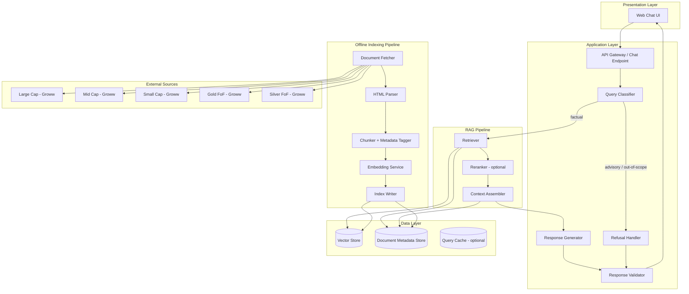
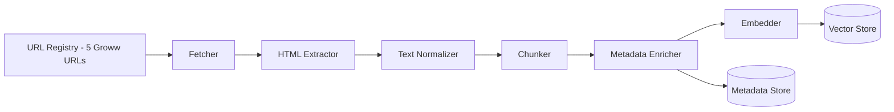
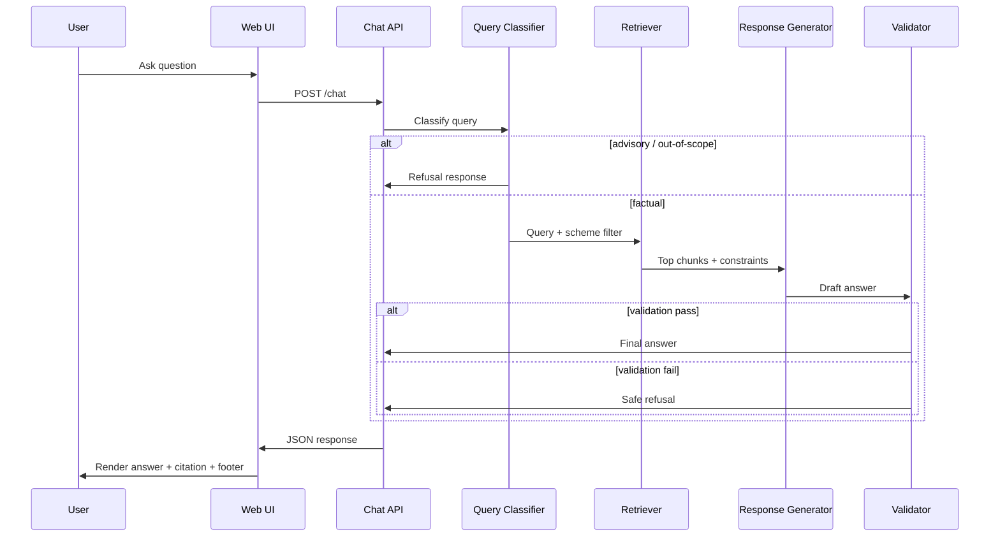
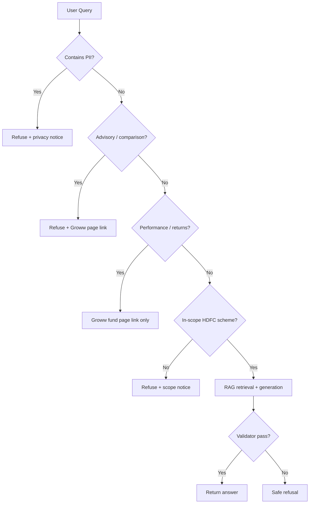
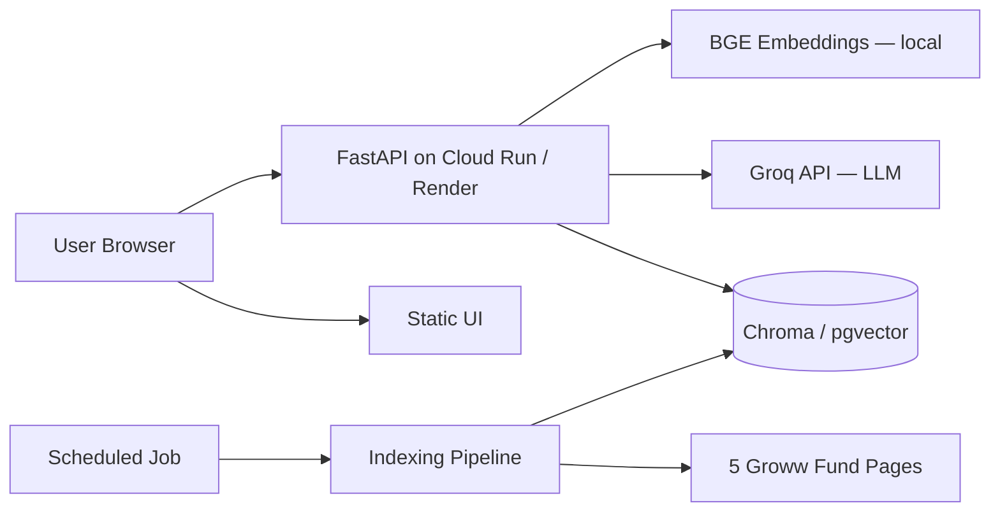

# Architecture: Mutual Fund FAQ Assistant

This document describes the system architecture for a **facts-only RAG-based FAQ assistant** scoped to five HDFC Mutual Fund schemes. It is derived from [problemStatement.md](./problemStatement.md).

**Corpus source policy (this implementation):** All external data is fetched exclusively from the **five Groww fund pages** listed below. There are no PDFs, AMC (hdfcfund.com), AMFI, or SEBI sources in the indexing pipeline.

**AI stack:** **Groq** for LLM text generation · **BGE** for local embedding and retrieval

---

## 1. Design Principles

| Principle | Implication |
| --- | --- |
| **Accuracy over intelligence** | Prefer grounded retrieval over open-ended generation; refuse when evidence is insufficient. |
| **Source-backed answers** | Every factual response cites exactly one Groww URL and includes a last-updated footer. |
| **Facts-only compliance** | No advice, comparisons, or return calculations; advisory queries are refused. |
| **Groww-only corpus** | The RAG index is built only from the five provided Groww fund pages — no PDFs or other domains. |
| **Privacy by design** | No PII collection (PAN, Aadhaar, account numbers, OTPs, email, phone). |
| **Lightweight footprint** | Minimal components suitable for a learning/demo project with a small curated corpus (5 URLs). |

---

## 2. External Sources (Corpus)

The indexing pipeline reads **only** from these Groww URLs:

| Scheme | Groww URL |
| --- | --- |
| HDFC Large Cap Fund Direct Growth | https://groww.in/mutual-funds/hdfc-large-cap-fund-direct-growth |
| HDFC Mid Cap Fund Direct Growth | https://groww.in/mutual-funds/hdfc-mid-cap-fund-direct-growth |
| HDFC Small Cap Fund Direct Growth | https://groww.in/mutual-funds/hdfc-small-cap-fund-direct-growth |
| HDFC Gold ETF Fund of Fund Direct Plan Growth | https://groww.in/mutual-funds/hdfc-gold-etf-fund-of-fund-direct-plan-growth |
| HDFC Silver ETF FoF Direct Growth | https://groww.in/mutual-funds/hdfc-silver-etf-fof-direct-growth |

No other external sources are fetched, parsed, or cited.

---

## 3. High-Level Architecture



### Architecture summary

The system splits into two main paths:

1. **Offline indexing** — Fetch the five Groww HTML pages, parse, chunk, embed, and store with scheme metadata.
2. **Online query handling** — Classify the user query, retrieve relevant chunks, generate a constrained response (or refuse), validate output, and return to the UI.

---

## 4. System Components

### 4.1 Presentation Layer (Web UI)

A minimal single-page chat interface inspired by Groww's product context.

**Responsibilities**

- Display welcome message scoped to the five HDFC schemes
- Show three clickable example questions
- Render persistent disclaimer: *Facts-only. No investment advice.*
- Accept free-text user queries and display assistant replies
- Render citation link and `Last updated from sources: <date>` footer

**UI elements**

| Element | Content |
| --- | --- |
| Header | Mutual Fund FAQ Assistant — HDFC Schemes |
| Disclaimer banner | Facts-only. No investment advice. |
| Example chips | Expense ratio (Large Cap), Exit load (Gold FoF), Min SIP (Small Cap) |
| Chat area | User/assistant message thread |
| Input | Text field + Send button (no login, no PII fields) |

**Recommended stack**

- **Frontend:** React or plain HTML/CSS/JS (Streamlit/Gradio acceptable for rapid prototyping)
- **Communication:** REST `POST /chat` or WebSocket for streaming (optional)

---

### 4.2 Application Layer

#### API Gateway / Chat Endpoint

Single entry point for all user messages.

```
POST /chat
Request:  { "message": "What is the expense ratio of HDFC Mid Cap Fund?" }
Response: {
  "answer": "...",
  "citation_url": "https://groww.in/mutual-funds/hdfc-mid-cap-fund-direct-growth",
  "last_updated": "2026-06-25",
  "type": "answer" | "refusal"
}
```

**Behavior**

- Stateless per request (no session PII)
- Rate limiting recommended for public deployment
- Logs query text only if compliant with privacy policy (avoid storing identifiable data)

#### Query Classifier

Runs **before** retrieval to route queries correctly.

| Class | Examples | Action |
| --- | --- | --- |
| `factual` | Expense ratio, exit load, min SIP, benchmark, riskometer | Proceed to RAG |
| `advisory` | "Should I invest?", "Which fund is better?" | Refusal handler |
| `performance` | "What returns did it give?", "Compare returns" | Refusal or Groww page link only |
| `out_of_scope` | Unrelated schemes, personal account queries | Refusal handler |
| `pii_request` | User shares PAN, folio, phone | Refusal + privacy notice |

**Implementation options**

- Rule-based keyword/pattern matching (fast, deterministic)
- Lightweight LLM classifier with a fixed system prompt (more flexible)
- Hybrid: rules first, LLM fallback for ambiguous cases

Recommended for compliance: **hybrid with conservative rules** — when in doubt, refuse or ask the user to rephrase as a factual question.

#### Retriever

Finds the top-k document chunks relevant to the query.

**Retrieval strategy**

1. **Scheme-aware filtering** — If the query mentions a scheme name (e.g., "Mid Cap"), filter metadata by `scheme_id` before vector search.
2. **Dense retrieval** — Cosine similarity over chunk embeddings.
3. **Optional keyword boost** — BM25 or exact match on fields like `expense_ratio`, `exit_load`, `benchmark`.
4. **Top-k** — Retrieve 3–5 chunks; pass top 1–2 to the generator after reranking.

#### Context Assembler

Builds the LLM prompt context from retrieved chunks.

Each chunk passed to the generator includes:

- Chunk text
- Source URL (Groww page for that scheme)
- Document type (`groww_fund_page`)
- Scheme name
- `last_updated` date from metadata (page fetch date or NAV date on page)

#### Response Generator

LLM (via **Groq**) produces the user-facing answer under strict constraints.

**System prompt constraints**

- Maximum **3 sentences**
- Use **only** provided context; do not infer or extrapolate
- Include **exactly one** citation URL — must be the Groww URL from the retrieved chunk metadata
- No investment advice, opinions, or comparisons
- If context is insufficient, respond with a refusal pattern

#### Refusal Handler

Dedicated path for non-factual queries — does **not** call the retriever or LLM for answer synthesis.

**Refusal template**

1. Polite acknowledgment
2. Facts-only limitation statement
3. One citation link to the **relevant Groww fund page** (if scheme is identifiable) or any in-scope Groww page as a general reference

Example refusal citation (scheme-specific):

- https://groww.in/mutual-funds/hdfc-large-cap-fund-direct-growth

#### Response Validator

Post-generation guardrail before returning to the UI.

| Check | Rule |
| --- | --- |
| Sentence count | ≤ 3 sentences |
| Citation | Exactly one valid URL from the five Groww pages |
| Advice patterns | Block "you should", "I recommend", "better fund", etc. |
| Performance | Block return percentages unless linking to Groww page only |
| PII | Block if response echoes user PII |
| URL domain | Must be `groww.in` and match one of the five corpus URLs |

If validation fails, fall back to a safe refusal response.

---

## 5. RAG Pipeline (Detailed)

### 5.1 Offline Indexing Pipeline



#### Step 1: URL Registry

Maintain a versioned config (YAML/JSON) with exactly five entries:

- `url` — one of the Groww fund pages
- `source_type`: `groww_fund_page`
- `scheme_id` (large_cap | mid_cap | small_cap | gold_fof | silver_fof)
- `scheme_name`
- `last_fetched`, `content_hash`

#### Step 2: Document Fetcher

- HTTP client with retries, timeout, and User-Agent
- Fetch **HTML only** from the five Groww URLs
- Store raw HTML snapshots in `data/raw/` for reproducibility
- Compute SHA-256 hash; re-index only when hash changes
- Use Playwright or similar if Groww pages require JavaScript rendering

#### Step 3: Parser

| Format | Tooling |
| --- | --- |
| HTML (Groww fund pages) | BeautifulSoup, Trafilatura, or Playwright |

Extract fund-specific content: expense ratio, exit load, min SIP, benchmark, riskometer, NAV date, and scheme description. Strip navigation, ads, and unrelated page chrome.

**Not in scope:** PDF parsing, SID/KIM extraction, or any non-Groww HTML.

#### Step 4: Chunking

| Parameter | Recommended value |
| --- | --- |
| Chunk size | 400–800 tokens |
| Overlap | 50–100 tokens |
| Boundary | Prefer section breaks (e.g., Exit Load, Minimum investments, About) |

**Metadata per chunk**

```json
{
  "chunk_id": "large_cap_groww_0042",
  "scheme_id": "large_cap",
  "scheme_name": "HDFC Large Cap Fund Direct Growth",
  "document_type": "groww_fund_page",
  "source_url": "https://groww.in/mutual-funds/hdfc-large-cap-fund-direct-growth",
  "source_domain": "groww.in",
  "section_title": "Exit Load",
  "last_updated": "2026-06-25",
  "text": "..."
}
```

#### Step 5: Embedding

- Model: **BGE** (Beijing Academy of Artificial Intelligence) via `sentence-transformers`
- Recommended: `BAAI/bge-small-en-v1.5` (configurable via `BGE_MODEL_NAME` in `.env`)
- Runs **locally** — no embedding API key required
- Batch embed all chunks; store vectors with chunk IDs
- Use the **same BGE model** at index time and query time for consistent retrieval

#### Step 6: Index Writer

Write to vector store and metadata store atomically per indexing run.

**Indexing schedule**

- Manual trigger for development
- Scheduled re-index (e.g., weekly) to pick up Groww page content changes

---

### 5.2 Online Retrieval & Generation



#### Retrieval query enhancement

Optional query rewriting (keep deterministic for compliance):

- Expand abbreviations: "TER" → "expense ratio", "FoF" → "fund of fund"
- Map aliases: "Gold fund" → `scheme_id: gold_fof`

#### Generation prompt structure

```
System: You are a facts-only mutual fund FAQ assistant for five HDFC schemes.
Rules:
- Answer in at most 3 sentences.
- Use ONLY the context below (from Groww fund pages).
- Cite exactly one Groww source URL from the context.
- Do not give investment advice or compare funds.

Context:
[chunk 1: source_url, last_updated, text]
[chunk 2: ...]

User question: {query}
```

#### Performance-related queries

Special handling per problem statement:

- Do **not** compute or state returns in the assistant's own words
- Respond with a brief pointer to the relevant **Groww fund page** only (1–2 sentences + link)

---

## 6. Data Layer

### 6.1 Vector Store

| Option | Use case |
| --- | --- |
| **Chroma** (local, embedded) | Default for lightweight/demo |
| **FAISS** (local file) | High performance, no server |
| **pgvector** | If PostgreSQL already in stack |

Collection name: `hdfc_mf_groww_corpus`

### 6.2 Metadata Store

Can be:

- Sidecar JSON/SQLite keyed by `chunk_id`
- Native metadata fields in Chroma

Used for scheme filtering, Groww citation URLs, and last-updated dates without re-parsing vectors.

### 6.3 Allowlisted URLs

Citations must be **exactly one** of these five URLs:

| Scheme | URL |
| --- | --- |
| HDFC Large Cap Fund Direct Growth | https://groww.in/mutual-funds/hdfc-large-cap-fund-direct-growth |
| HDFC Mid Cap Fund Direct Growth | https://groww.in/mutual-funds/hdfc-mid-cap-fund-direct-growth |
| HDFC Small Cap Fund Direct Growth | https://groww.in/mutual-funds/hdfc-small-cap-fund-direct-growth |
| HDFC Gold ETF Fund of Fund Direct Plan Growth | https://groww.in/mutual-funds/hdfc-gold-etf-fund-of-fund-direct-plan-growth |
| HDFC Silver ETF FoF Direct Growth | https://groww.in/mutual-funds/hdfc-silver-etf-fof-direct-growth |

Domain allowlist: `groww.in` only.

---

## 7. Query Routing Decision Tree



---

## 8. Response Contract

All assistant messages conform to one of two shapes.

### 8.1 Factual Answer

```json
{
  "type": "answer",
  "text": "The expense ratio of HDFC Large Cap Fund Direct Growth is 1.04%. Minimum SIP is ₹100.",
  "citation_url": "https://groww.in/mutual-funds/hdfc-large-cap-fund-direct-growth",
  "last_updated": "2026-06-25",
  "disclaimer": "Facts-only. No investment advice."
}
```

Rendered footer:

> Last updated from sources: 2026-06-25

### 8.2 Refusal

```json
{
  "type": "refusal",
  "text": "I can only answer factual questions about the five listed HDFC schemes. I cannot provide investment advice or compare funds.",
  "citation_url": "https://groww.in/mutual-funds/hdfc-large-cap-fund-direct-growth",
  "last_updated": "2026-06-25",
  "disclaimer": "Facts-only. No investment advice."
}
```

---

## 9. Recommended Technology Stack

| Layer | Technology | Rationale |
| --- | --- | --- |
| Language | Python 3.11+ | Rich RAG/ML ecosystem |
| API | FastAPI | Lightweight, typed, async-friendly |
| UI | Streamlit or React | Streamlit for fast demo; React for Groww-like UX |
| **Embeddings** | **BGE** (`BAAI/bge-small-en-v1.5` via sentence-transformers) | Local, free, strong retrieval quality; no API dependency |
| **LLM** | **Groq** (e.g., `llama-3.3-70b-versatile`) | Fast inference, low cost; sufficient for constrained generation |
| Vector DB | Chroma | Zero-config local development |
| HTML parsing | Trafilatura / Playwright | Groww pages may need JS rendering |
| Config | YAML + pydantic | Versioned corpus registry (5 URLs) |
| Orchestration | LangChain or LlamaIndex (optional) | Speed up RAG boilerplate |

### 9.1 AI Model Configuration

| Role | Provider | Model | Config |
| --- | --- | --- | --- |
| Embeddings | Local (sentence-transformers) | `BAAI/bge-small-en-v1.5` | `BGE_MODEL_NAME` (optional override) |
| Text generation | Groq | `llama-3.3-70b-versatile` (default) | `GROQ_API_KEY`, `GROQ_MODEL` |

**Environment variables (`.env`)**

```bash
GROQ_API_KEY=your_groq_api_key
GROQ_MODEL=llama-3.3-70b-versatile
BGE_MODEL_NAME=BAAI/bge-small-en-v1.5
```

**Python dependencies**

- `groq` — Groq API client for response generation
- `sentence-transformers` — load and run BGE embeddings locally

---

## 10. Project Structure (Proposed)

```
m2_6/
├── docs/
│   ├── problemStatement.md
│   └── Architecture.md
├── config/
│   └── corpus.yaml              # 5 Groww URLs + scheme metadata
├── data/
│   ├── raw/                     # Fetched Groww HTML snapshots
│   └── index/                   # Vector store persistence
├── src/
│   ├── ingestion/
│   │   ├── fetcher.py           # Groww HTML fetcher only
│   │   ├── parser.py            # HTML parser only
│   │   ├── chunker.py
│   │   └── indexer.py
│   ├── rag/
│   │   ├── retriever.py
│   │   ├── classifier.py
│   │   ├── generator.py
│   │   └── validator.py
│   ├── api/
│   │   └── main.py              # FastAPI /chat endpoint
│   └── ui/
│       └── app.py               # Streamlit or static frontend
├── scripts/
│   ├── build_index.py
│   └── refresh_corpus.py
├── tests/
│   ├── test_classifier.py
│   ├── test_validator.py
│   └── test_retrieval.py
├── requirements.txt
└── README.md
```

---

## 11. Security & Privacy

| Requirement | Implementation |
| --- | --- |
| No PII storage | Stateless API; no user accounts; no conversation persistence with identifiers |
| PII detection | Regex/rules for PAN, Aadhaar, phone, email in user input; block and warn |
| Input sanitization | Max query length; strip HTML/script |
| Output filtering | Validator blocks advice language and non-allowlisted URLs |
| Secrets | API keys in environment variables only (`.env`, not committed) |
| Corpus integrity | Hash-based change detection; index only the five Groww URLs from config |

---

## 12. Deployment Architecture

### 12.1 Local Development

```
[Browser] → [Streamlit/FastAPI on localhost] → [Chroma local] → [BGE embeddings local]
                                              ↘ [Groq API — LLM generation]
                                              ↘ [Groww pages at index time]
```

### 12.2 Minimal Production



- UI: static hosting (Vercel, Netlify, or served by FastAPI)
- API: containerized Python service
- Index refresh: cron job (weekly) or manual CI workflow — re-fetches only Groww pages
- No database required for user data

---

## 13. Testing Strategy

| Test type | Focus |
| --- | --- |
| **Unit** | Classifier rules, validator sentence/URL checks, chunk metadata |
| **Retrieval** | Known queries return correct scheme chunks from Groww index |
| **Compliance** | Advisory queries always refused; no return calculations in output |
| **Regression** | Golden set of ~15 Q&A pairs with expected Groww citation URLs |
| **Corpus** | Index rebuild is deterministic; chunk count stable for unchanged Groww pages |

**Example golden queries**

| Query | Expected behavior |
| --- | --- |
| What is the minimum SIP for HDFC Small Cap Fund? | Factual; cites groww.in small-cap URL |
| Should I invest in HDFC Gold ETF FoF? | Refusal; Groww page link |
| Which is better — Large Cap or Mid Cap? | Refusal |
| What was the 3-year return of HDFC Mid Cap Fund? | Groww page link only; no return stated |
| What is the exit load for HDFC Gold ETF FoF? | Factual; cites groww.in gold FoF URL |

---

## 14. Known Limitations

| Limitation | Mitigation |
| --- | --- |
| Corpus covers only 5 HDFC schemes on Groww | Clear UI scope message; refuse out-of-scope schemes |
| Single source (Groww) — no PDFs or AMC documents | Document in README; re-fetch Groww pages periodically |
| Groww page content may change or require JS rendering | Use Playwright for fetch; store raw HTML snapshots |
| Static corpus may drift from live Groww data | Display `last_updated` footer; periodic re-index |
| LLM hallucination risk | Strict context-only prompt + validator + low temperature |
| No personal account or folio queries | Refuse; no account-specific data on Groww pages |
| English-only in v1 | Document as future enhancement |

---

## 15. Future Enhancements (Out of Scope for v1)

- Add official AMC PDFs (SID/KIM) and regulatory sources (AMFI, SEBI) as supplementary corpus
- Multi-AMC corpus expansion
- Conversational follow-ups with scoped context (still no PII)
- Streaming responses in UI
- Automated Groww page change detection
- Hindi language support
- Admin dashboard for corpus health and query analytics (aggregated, anonymous)

---

## 16. Alignment with Success Criteria

| Success criterion | Architectural mechanism |
| --- | --- |
| Accurate factual retrieval | Scheme-aware vector search over five Groww pages |
| Facts-only responses | Query classifier + constrained prompts + validator |
| Valid source citations | Metadata-driven single Groww URL; strict allowlist |
| Proper refusal of advisory queries | Dedicated refusal path before RAG |
| Clean minimal UI | Single-page chat with disclaimer and example questions |

---

## 17. References

- [Problem Statement](./problemStatement.md) — requirements, scheme list, constraints
- [HDFC Large Cap Fund — Groww](https://groww.in/mutual-funds/hdfc-large-cap-fund-direct-growth)
- [HDFC Mid Cap Fund — Groww](https://groww.in/mutual-funds/hdfc-mid-cap-fund-direct-growth)
- [HDFC Small Cap Fund — Groww](https://groww.in/mutual-funds/hdfc-small-cap-fund-direct-growth)
- [HDFC Gold ETF FoF — Groww](https://groww.in/mutual-funds/hdfc-gold-etf-fund-of-fund-direct-plan-growth)
- [HDFC Silver ETF FoF — Groww](https://groww.in/mutual-funds/hdfc-silver-etf-fof-direct-growth)
