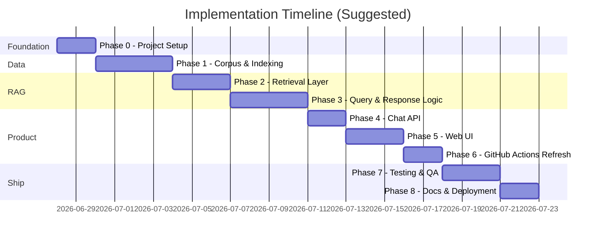
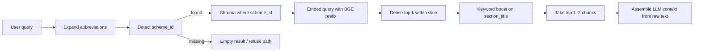
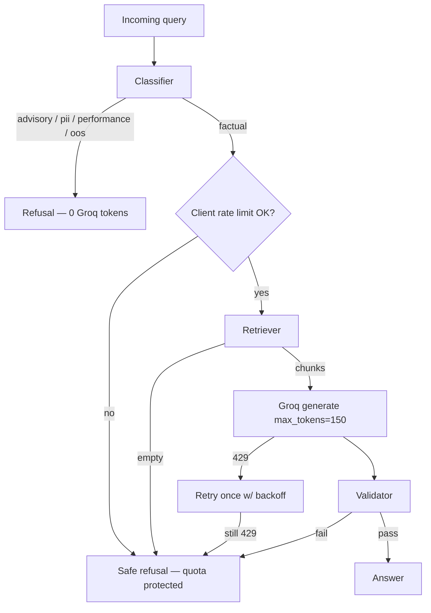
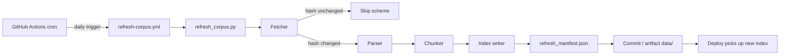
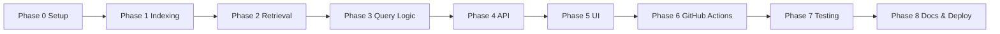

# Phase-Wise Implementation Plan

This document defines a phased rollout for the **Mutual Fund FAQ Assistant** based on [Architecture.md](./Architecture.md). Each phase has clear goals, tasks, deliverables, and exit criteria before moving to the next.

---

## Overview



| Phase | Name | Primary output |
| --- | --- | --- |
| 0 | Project setup | Repo scaffold, config, dependencies |
| 1 | Corpus & indexing | Vector index from 5 Groww pages |
| 2 | Retrieval layer | Scheme-aware chunk retrieval |
| 3 | Query & response logic | Classifier, generator, validator, refusal |
| 4 | Chat API | `POST /chat` endpoint |
| 5 | Web UI | Minimal chat interface |
| 6 | Scheduled ingestion | Daily GitHub Actions workflow → corpus refresh + re-index |
| 7 | Testing & QA | Golden tests, compliance checks |
| 8 | Documentation & deployment | README, runbook, optional deploy |

**Estimated total:** ~3.5 weeks for a single developer (adjust per team size).

**AI stack:** **Groq** for LLM generation · **BGE small** (`BAAI/bge-small-en-v1.5`) for local embeddings — see §1.4 for model choice rationale

---

## Phase 0: Project Setup

**Goal:** Establish repository structure, tooling, and configuration so later phases can proceed without rework.

### Tasks

1. Create directory layout per Architecture §10:
   - `config/`, `data/raw/`, `data/index/`, `src/`, `scripts/`, `tests/`
2. Add `requirements.txt` with core dependencies:
   - FastAPI, uvicorn, pydantic, pyyaml
   - chromadb, sentence-transformers (BGE embeddings)
   - groq (Groq LLM API client)
   - httpx, beautifulsoup4, trafilatura
   - playwright (optional, for JS-rendered Groww pages)
   - pytest, python-dotenv
3. Create `config/corpus.yaml` with all five Groww URLs and scheme metadata:
   - `scheme_id`, `scheme_name`, `url`, `source_type: groww_fund_page`
4. Add `.env.example` for Groq and BGE configuration:
   - `GROQ_API_KEY`, `GROQ_MODEL=llama-3.3-70b-versatile`
   - `GROQ_MAX_TOKENS`, `GROQ_RPM_LIMIT`, `GROQ_TPM_LIMIT`, etc. (Groq free-tier guardrails — see Phase 3 §3.6)
   - `BGE_MODEL_NAME=BAAI/bge-small-en-v1.5` (optional override)
5. Add `.gitignore` — exclude `.env`, `data/index/`, `data/raw/`, `__pycache__/`
6. Define shared constants module (allowlisted Groww URLs, scheme aliases)

### Deliverables

- [ ] Runnable Python 3.11+ virtual environment
- [ ] `config/corpus.yaml` with 5 scheme entries
- [ ] Empty package structure under `src/`
- [ ] `scripts/build_index.py` stub (CLI entry point)

### Exit criteria

- `python -c "import yaml; yaml.safe_load(open('config/corpus.yaml'))"` succeeds
- Project structure matches Architecture §10
- No secrets committed to git

---

## Phase 1: Corpus & Indexing Pipeline

**Goal:** Fetch, parse, chunk, embed, and persist all content from the five Groww fund pages into a local vector store.

**Architecture reference:** §2 (External Sources), §5.1 (Offline Indexing)

### Tasks

#### 1.1 Document fetcher (`src/ingestion/fetcher.py`)

- Read URLs from `config/corpus.yaml`
- HTTP GET with retries, timeout, and User-Agent
- Fall back to Playwright if static fetch returns empty/minimal content
- Save raw HTML to `data/raw/{scheme_id}.html`
- Compute SHA-256 hash; skip re-fetch if unchanged (optional flag to force refresh)

#### 1.2 HTML parser (`src/ingestion/parser.py`)

- Extract fund-relevant sections:
  - Expense ratio, exit load, min SIP, benchmark, riskometer, NAV date, AUM
  - Investment objective, fund manager (if present)
- Strip nav, footer, ads, and unrelated chrome
- Return structured dict per page: `{ scheme_id, text_blocks[], nav_date, fetched_at }`
- Write review files to `data/parsed/{scheme_id}.json` and `data/parsed/parse_manifest.json`

#### 1.3 Chunker (`src/ingestion/chunker.py`)

**Strategy (adapted from Architecture §5.1):** Groww fund pages parse into seven small, fact-dense sections per scheme (~8–130 tokens each after cleanup). A generic 400–800 token packer would merge all facts into one blob, so distinct queries ("expense ratio?", "exit load?", "benchmark?") would retrieve the same chunk. The implemented strategy is **section-atomic chunking** with targeted cleanup — not fixed-size token packing.

**Why not 400–800 token chunks?**

| Parsed section | Typical size | RAG concern if merged |
| --- | --- | --- |
| Key fund facts | ~55 tokens | Expense ratio, min SIP, AUM, riskometer collapse into one blob |
| Exit load | ~10 tokens | Distinct fact lost in merged chunk |
| Benchmark | ~8 tokens | Same |
| Investment objective | ~20 tokens | Same |
| Stamp duty and tax | ~40 tokens | Same |
| Minimum investments | ~15 tokens | Same |
| Fund management (raw) | 400–900+ tokens | "Also manages these schemes …" lists name *other* HDFC schemes → cross-scheme leakage (RT-05) |

**Chunking rules**

1. **One chunk per parsed section** — boundaries follow parser section titles: Key fund facts, Exit load, Benchmark, Investment objective, Stamp duty and tax, Fund management, Minimum investments.
2. **Noise stripping (Fund management only)** — remove "Also manages these schemes …" lists and "View details" chrome; keep manager name, tenure, education, and experience. Prevents other-scheme names from appearing in a scheme's indexed chunks.
3. **Dual text fields per chunk:**
   - `text` — clean fact text passed to the LLM at answer time
   - `embed_text` — `"<scheme_name> | <section_title>: <text>"` used for BGE embedding (disambiguates short facts like "Exit load of 1%" across schemes). Hard scheme filtering still uses `scheme_id` metadata at retrieval time.
4. **Overflow split (fallback only)** — if a section exceeds `MAX_CHUNK_TOKENS` (480), split with `CHUNK_OVERLAP_TOKENS` (60) word-window overlap. After Fund management cleanup, all sections fit in a single chunk.

**Parameters** (in `src/constants.py`)

| Constant | Value | Purpose |
| --- | --- | --- |
| `MAX_CHUNK_TOKENS` | 480 | Overflow split threshold (Architecture §5.1 upper bound) |
| `CHUNK_OVERLAP_TOKENS` | 60 | Overlap when overflow split triggers (Architecture §5.1 range) |

**Expected yield:** 7 chunks × 5 schemes = **35 chunks** (stable across re-runs when raw HTML is unchanged).

**Metadata per chunk** (Architecture §5.1):

- `chunk_id` — `{scheme_id}_groww_{NNNN}` (e.g. `large_cap_groww_0001`)
- `scheme_id`, `scheme_name`, `document_type` (`groww_fund_page`)
- `source_url`, `source_domain` (`groww.in`)
- `section_title`, `last_updated` (NAV date normalized to ISO `YYYY-MM-DD`; fallback to fetch date)

**Review output:** `data/chunks/{scheme_id}.json` and `data/chunks/chunk_manifest.json`

#### 1.4 Embedder & index writer (`src/ingestion/indexer.py`)

**Corpus profile (from `data/chunks/chunk_manifest.json`, 2026-06-28):**

| Metric | Value | Embedding implication |
| --- | --- | --- |
| Total chunks | **35** (7 × 5 schemes) | Tiny index — build and query latency dominated by model load, not vector count |
| Token range | **8–129** per chunk (`token_estimate`) | All chunks well below BGE's 512-token limit; no truncation risk |
| Longest section | Fund management (~96–129 tokens) | Largest chunk after noise stripping; still a single embed call |
| Shortest sections | Benchmark (~8–11 tokens), Exit load (~12 tokens) | High cross-scheme similarity — scheme prefix in `embed_text` is essential |
| Near-duplicate text | Exit load, Stamp duty and tax, Minimum investments repeat across schemes with minor deltas | Dense retrieval alone cannot disambiguate; hard `scheme_id` filter at query time is the primary guardrail |

**Model choice: BGE small (recommended) vs BGE large**

| | `BAAI/bge-small-en-v1.5` | `BAAI/bge-large-en-v1.5` |
| --- | --- | --- |
| Dimensions | 384 | 1024 |
| Params / RAM | ~33M / ~130 MB | ~335M / ~1.3 GB |
| Cold start | Fast | 3–5× slower first load |
| MTEB retrieval | Strong for short-passage QA at its size | Marginal gains on long/complex corpora |

**Recommendation: use BGE small.** This corpus is 35 section-atomic, fact-dense chunks (8–129 tokens). Retrieval runs inside a **scheme-filtered subset of ~7 chunks**, not open search over thousands of documents. The hard problems — cross-scheme disambiguation of identical exit-load/tax/min-SIP text, and mapping "TER" → expense ratio — are solved by `scheme_id` metadata filtering, `embed_text` section prefixes, and query abbreviation expansion (Phase 2), not by higher-dimensional embeddings. BGE large adds memory and cold-start cost without meaningful upside on this scale. Reserve `BGE_MODEL_NAME=BAAI/bge-large-en-v1.5` only if Phase 7 retrieval tests show systematic misses on paraphrased queries after scheme filter + keyword boost are in place.

**Embedding strategy**

1. **Index field:** embed **`embed_text`** only (not raw `text`). Format: `"<scheme_name> | <section_title>: <text>"`. The scheme name and section title give BGE enough context for short facts (e.g. `"Exit load of 1%"`) to land near the right vector within a scheme's slice.
2. **Query field:** embed the user query (after optional abbreviation expansion) with the BGE v1.5 query instruction prefix:
   ```
   Represent this sentence for searching relevant passages: {query}
   ```
   Documents/chunks are embedded **without** this prefix (standard BGE asymmetric retrieval).
3. **LLM context field:** pass raw **`text`** to the generator — cleaner for answer synthesis; no scheme prefix noise in the prompt.
4. **Similarity:** cosine distance in Chroma (L2-normalized BGE outputs); no reranker needed at this corpus size.
5. **Batching:** embed all 35 chunks in one batch at index time; store `embedding_model`, `embedded_at`, and `chunk_count` in index metadata for RT-10 mismatch detection.
6. **Rebuild rule:** changing `BGE_MODEL_NAME` requires a full re-embed (`build_index.py --force-refresh`); vectors from different models are not interchangeable.

**Implementation tasks**

- Load **BGE small** via `sentence-transformers` (default: `BAAI/bge-small-en-v1.5`; override via `BGE_MODEL_NAME`)
- Batch-embed all `embed_text` values locally — no embedding API calls
- Write to Chroma collection `hdfc_mf_groww_corpus` in `data/index/`
- Persist chunk metadata alongside vectors; validate `embedding_model` on retriever startup (Phase 2)

#### 1.5 Build script (`scripts/build_index.py`)

- Orchestrate: fetch → parse → chunk → embed → index
- CLI flags: `--force-refresh`, `--scheme large_cap` (single-scheme rebuild)
- Log chunk counts per scheme and total index size

### Deliverables

- [ ] `src/ingestion/fetcher.py`, `parser.py`, `chunker.py`, `indexer.py`
- [ ] `scripts/build_index.py` runs end-to-end
- [ ] `data/raw/` contains 5 HTML snapshots
- [ ] `data/parsed/` contains 5 parsed JSON review files
- [ ] `data/chunks/` contains 35 section-atomic chunks (7 per scheme)
- [ ] `data/index/` contains populated Chroma collection

### Exit criteria

- Index builds successfully for all 5 Groww URLs
- Manual spot-check: chunks for Large Cap contain expense ratio (~1.04%) and min SIP (₹100)
- Chunk count stable at **35 total** (7 per scheme) when raw HTML is unchanged
- Fund management chunks contain no "Also manages these schemes" noise or other-scheme names
- Re-running build with unchanged HTML produces stable chunk count (± small variance from chunker tuning)
- No PDF or non-Groww URLs in index metadata

### Risks & mitigations

| Risk | Mitigation |
| --- | --- |
| Groww blocks scraper | Playwright + realistic User-Agent; rate-limit requests |
| JS-rendered content | Playwright fetch in Phase 1.1 |
| Noisy HTML | Iterative parser tuning against saved `data/raw/` snapshots |
| Cross-scheme retrieval leakage | Strip "Also manages these schemes" from Fund management chunks; scheme-context `embed_text`; hard `scheme_id` filter at retrieval (Phase 2) |
| Short-fact embedding ambiguity | Prefix `embed_text` with scheme name and section title; hard `scheme_id` filter limits comparison to ~7 chunks per query |
| BGE small vs large trade-off | Default to `bge-small-en-v1.5`; upgrade to large only if Phase 7 retrieval golden tests fail on paraphrased queries |

---

## Phase 2: Retrieval Layer

**Goal:** Given a user query, retrieve the most relevant chunks from the vector store with scheme-aware filtering.

**Architecture reference:** §4.2 (Retriever), §6 (Data Layer)

**Corpus constraints (from Phase 1):** 35 section-atomic chunks (7 per scheme × 5 schemes). Each scheme's slice is small enough that retrieval is a **filtered search over ~7 vectors**, not open corpus search. Cross-scheme facts (identical exit-load wording, shared tax boilerplate) are disambiguated primarily by hard `scheme_id` metadata filtering — dense similarity alone cannot separate them.

### Retrieval pipeline



### Tasks

#### 2.1 Query enhancement (`src/rag/query_utils.py`)

Run **before** embedding so BGE sees expanded terms (RT-14).

1. **Abbreviation expansion** (`QUERY_ABBREVIATIONS` in `src/constants.py`):
   - `TER` → `expense ratio` (matches "Expense ratio:" in Key fund facts chunks)
   - `FoF` → `fund of fund` (helps Gold/Silver FoF queries)
2. **Scheme detection** — longest-match scan of `SCHEME_ALIASES` on lowercased query:
   - `"gold fund exit load"` → `gold_fof` before vector search
   - `"HDFC Mid Cap Fund"` → `mid_cap`
3. **No scheme detected (RT-02):** return empty retrieval result; Phase 3 refusal path handles ambiguous queries like "What is the expense ratio?" with no scheme name.

#### 2.2 Retriever (`src/rag/retriever.py`)

**Startup**

- Load Chroma collection from `data/index/`; fail fast if missing (RT-08)
- Verify `embedding_model` in index manifest + collection metadata matches `BGE_MODEL_NAME` (RT-10)
- Load the **same BGE model** used at index time (reuse `load_embedding_model`, `embed_query_text` from `src/ingestion/indexer.py`)

**Search (within detected scheme slice)**

| Step | Parameter | Rationale |
| --- | --- | --- |
| Chroma metadata filter | `where={"scheme_id": "<detected>"}` | Limits search to ~7 chunks; prevents RT-05 cross-scheme leakage |
| Query embedding | BGE prefix + expanded query | Asymmetric retrieval per §1.4 |
| Dense retrieval | `top_k=3` | Enough candidates when keyword boost reranks; k=5 redundant on 7-chunk slice |
| Similarity floor | `MIN_SIMILARITY = 0.25` (cosine) | RT-03/RT-04: below threshold → empty result for refusal |
| Keyword boost | `+0.12` when query maps to `section_title` | Disambiguates within-scheme sections without a reranker |

**Query term → section mapping** (keyword boost targets)

| Query signals | Target `section_title` |
| --- | --- |
| expense ratio, ter, nav, aum, riskometer, risk | Key fund facts |
| exit load, redemption charge | Exit load |
| benchmark, index | Benchmark |
| min sip, minimum sip, lumpsum, minimum investment | Minimum investments (fallback: Key fund facts also lists min SIP) |
| stamp duty, tax, stt | Stamp duty and tax |
| investment objective, objective | Investment objective |
| fund manager, manager, tenure | Fund management |

Boost applies when the mapped section title equals the chunk's `section_title` (case-insensitive). Final score = `cosine_similarity + boost`; sort descending.

**Output**

- Return top **1–2** chunks (`RETRIEVAL_CONTEXT_CHUNKS=2`) with full metadata
- Pass raw **`text`** (Chroma `documents` field), not `embed_text`, to the LLM context assembler
- Include `score`, `chunk_id`, `scheme_id`, `section_title`, `source_url`, `last_updated`

#### 2.3 Context assembler (within `retriever.py`)

- Select top 1–2 chunks after dense + keyword rerank
- Format context block for LLM prompt (one block per chunk):
  ```
  [source_url | last_updated | section_title]
  {chunk text}
  ```
- Join multiple blocks with `\n\n---\n\n` when two sections are returned (rare for single-fact FAQ queries)

### Deliverables

- [x] `src/rag/query_utils.py` — abbreviation expansion and scheme detection
- [x] `src/rag/retriever.py` with scheme filtering, keyword boost, and context assembly
- [x] `scripts/test_retrieval.py` — CLI to test retrieval interactively
- [x] `tests/test_retrieval.py` with 5+ query → expected scheme_id assertions

### Exit criteria

- "What is the expense ratio of HDFC Mid Cap Fund?" retrieves mid_cap chunks
- "Exit load for Gold ETF FoF" retrieves gold_fof chunks
- Retrieval latency < 2s locally (excluding cold start)

---

## Phase 3: Query & Response Logic

**Goal:** Route queries correctly, generate constrained answers, validate output, and handle refusals — the core compliance layer.

**Architecture reference:** §4.2 (Classifier, Generator, Validator, Refusal), §7 (Decision Tree), §8 (Response Contract)

### Groq quota constraints (`llama-3.3-70b-versatile`)

Free-tier limits for the default model (verify against [Groq console](https://console.groq.com) if quotas change):

| Limit | Value | Phase 3 implication |
| --- | --- | --- |
| Requests per minute (RPM) | **30** | Burst cap; unlikely to hit in dev/demo |
| Requests per day (RPD) | **1,000** | Comfortable for QA + demo; monitor in `/health` |
| Tokens per minute (TPM) | **12,000** | **Primary sustained bottleneck** for factual traffic |
| Tokens per day (TPD) | **100,000** | ~150–180 factual answers/day at estimated budget below |

**Estimated tokens per factual Groq call** (this corpus — not a generic chat app):

| Component | Est. tokens | Notes |
| --- | --- | --- |
| System prompt | ~150 | Fixed, concise facts-only rules |
| Retrieved context (1–2 chunks) | ~150–250 | Section-atomic chunks are 8–129 tokens each |
| User query | ~20–40 | API caps input at 500 chars (Phase 4) |
| Completion (`max_tokens`) | ≤ **150** | Hard cap — answers are ≤ 3 sentences |
| **Total per call** | **~400–600** | Use **550** for capacity planning |

**Effective capacity (factual queries only):**

| Groq limit | At ~550 tokens/call | Binding? |
| --- | --- | --- |
| 12,000 TPM | ~**21** factual calls/min sustained | **Yes** — tighter than 30 RPM |
| 100,000 TPD | ~**180** factual calls/day | Yes, for heavy demo days |
| 1,000 RPD | ~1,000 calls/day | No, at this token budget |

Non-factual paths (**advisory, PII, performance, out_of_scope**) must **never call Groq** — they use fixed refusal/link templates. That is the largest quota saver: a well-classified FAQ assistant spends Groq budget only on `factual` queries.



### Tasks

#### 3.1 Query classifier (`src/rag/classifier.py`)

Implement rule-based routing (hybrid optional later):

| Class | Detection | Action |
| --- | --- | --- |
| `pii` | PAN, Aadhaar, phone, email patterns | Refusal + privacy notice — **no Groq** |
| `advisory` | "should I invest", "which is better", "recommend" | Refusal handler — **no Groq** |
| `performance` | "returns", " CAGR", "performance", "compare returns" | Groww link only (no numbers) — **no Groq** |
| `out_of_scope` | Non-HDFC schemes, folio/account queries | Refusal handler — **no Groq** |
| `factual` | Default for in-scope factual questions | RAG pipeline → **one Groq call** |

Return: `{ "class": "...", "scheme_id": "..." | null }`

**Quota note:** Classifier accuracy directly protects TPM — misrouting advisory queries to the generator wastes ~550 tokens per call.

#### 3.2 Refusal handler (`src/rag/refusal.py` or within classifier module)

- Fixed templates — no LLM generation (**0 Groq tokens**)
- Include one Groww URL (scheme-specific if detected, else Large Cap default)
- Fields: `type: refusal`, `text`, `citation_url`, `last_updated`, `disclaimer`
- Use for: classifier refusals, empty retrieval (RT-03), validator failures, and Groq quota/errors (see §3.6)

#### 3.3 Response generator (`src/rag/generator.py`)

- System prompt per Architecture §5.2 (≤3 sentences, context-only, one Groww citation) — keep under ~200 tokens; no few-shot examples in v1
- Pass assembled context + user query to **Groq** LLM via `groq` SDK
- Default model: `llama-3.3-70b-versatile` (override via `GROQ_MODEL`)
- Generation parameters tuned for quota + compliance:

| Parameter | Value | Rationale |
| --- | --- | --- |
| `temperature` | `0.1` | Low variance; compliance-friendly |
| `max_tokens` | **`150`** | ≤3 sentences; limits completion TPD/TPM |
| `timeout` | **`25s`** | Fail before Groq hang; leave margin under 30s API budget (LL-03) |

- **No retry on validator failure** — return safe refusal instead of a second Groq call (saves 550 tokens per bad generation)
- Parse LLM output into structured response; extract citation URL from context metadata

#### 3.4 Response validator (`src/rag/validator.py`)

Enforce before returning to caller:

- [ ] ≤ 3 sentences
- [ ] Citation URL ∈ allowlist (5 Groww URLs)
- [ ] No advice patterns ("you should", "I recommend", "better fund")
- [ ] No return percentages in answer text (unless `performance` class → link-only path)
- [ ] No echoed PII

On failure → return safe refusal response (**do not re-call Groq**).

#### 3.5 Orchestrator (`src/rag/pipeline.py`)

Wire classifier → (retriever + generator | refusal) → validator into single `answer(query: str) -> ChatResponse` function.

- Check client-side Groq quota **before** calling the generator (§3.6)
- Short-circuit: `pii` / `advisory` / `performance` / `out_of_scope` → refusal with no retriever or Groq
- Empty retrieval → refusal with no Groq
- Exactly **one** Groq `chat.completions` call per successful factual path

#### 3.6 Groq client & rate limiting (`src/rag/groq_client.py`)

Wrap the `groq` SDK with quota-aware behavior:

**Client-side sliding-window limiter** (in-process; sufficient for single-instance dev/demo):

| Window | Cap (configurable) | Default | Headroom vs Groq |
| --- | --- | --- | --- |
| 60s requests | `GROQ_RPM_LIMIT` | **25** | Under 30 RPM |
| 60s tokens | `GROQ_TPM_LIMIT` | **10,000** | Under 12K TPM (~18 calls at 550 tok) |
| 24h requests | `GROQ_RPD_LIMIT` | **900** | Under 1K RPD |
| 24h tokens | `GROQ_TPD_LIMIT` | **90,000** | Under 100K TPD |

- Pre-flight: estimate prompt tokens (`len(system + context + query) // 4` or `tiktoken` if added); reject with safe refusal if window would exceed TPM/TPD
- Post-call: increment counters with actual `usage.total_tokens` from Groq response when available; fall back to estimate
- **429 handling (LL-02):** retry **once** after `Retry-After` header or exponential backoff (2s → 4s); then safe refusal — never loop
- **Timeout / 5xx:** safe refusal; no unbounded retries
- Expose `get_quota_status()` for Phase 4 `/health` (remaining RPM/TPM headroom, last 429 timestamp)

**Optional env vars** (add to `.env.example`):

```bash
GROQ_MAX_TOKENS=150
GROQ_REQUEST_TIMEOUT=25
GROQ_RPM_LIMIT=25
GROQ_TPM_LIMIT=10000
GROQ_RPD_LIMIT=900
GROQ_TPD_LIMIT=90000
```

**Multi-instance deployment (Phase 8):** in-process limiter is per pod — use a shared store (Redis) or edge rate limiting if horizontally scaled; document in README.

### Deliverables

- [x] `src/rag/classifier.py`, `generator.py`, `validator.py`, `pipeline.py`
- [x] `src/rag/groq_client.py` — wrapped SDK, sliding-window limiter, 429 retry
- [x] `.env.example` updated with Groq limit overrides
- [x] `tests/test_classifier.py` — advisory/PII/performance cases
- [x] `tests/test_validator.py` — sentence count, URL allowlist, advice blocking
- [x] `tests/test_groq_client.py` — limiter rejects over-quota; 429 retry once then refusal
- [x] `tests/test_pipeline.py` — orchestrator paths without redundant Groq calls
- [x] `scripts/answer_query.py` — CLI to run `answer()` end-to-end

### Exit criteria

- Advisory query → refusal, **no Groq API call**
- Factual query → answer with valid Groww citation, **≤1 Groq call**
- Validator rejects hallucinated non-allowlisted URLs **without** re-generating
- Performance query → Groww link only, no stated returns, **no Groq call**
- All responses include `disclaimer: "Facts-only. No investment advice."`
- Simulated 429 → one retry, then safe refusal
- Client limiter blocks call when TPM window exhausted → safe refusal (no Groq 429 storm)

### Risks & mitigations

| Risk | Mitigation |
| --- | --- |
| TPM exhausted under demo load | Client limiter at 10K TPM; refusal template explains temporary limit; `/health` shows quota |
| Misclassified advisory hits Groq | Classifier tests (7/7 gate); conservative rules |
| Validator fail triggers re-generation | **Forbidden** — refusal only (saves 550 tokens/call) |
| Token underestimate in limiter | Use Groq `usage.total_tokens` post-call; pre-flight over-estimate by 10% |
| Daily quota hit mid-session | TPD counter + `/health` warning at 80%; safe refusal at cap |
| Multi-tab UI spam | Phase 4 API input rate limit aligned with `GROQ_RPM_LIMIT` |

---

## Phase 4: Chat API

**Goal:** Expose the RAG pipeline via a stateless REST endpoint.

**Architecture reference:** §4.2 (API Gateway), §8 (Response Contract), §11 (Security)

### Tasks

#### 4.1 FastAPI app (`src/api/main.py`)

- `POST /chat` — request body: `{ "message": string }`
- Response body matches Architecture §8 (`type`, `text`, `citation_url`, `last_updated`, `disclaimer`)
- `GET /health` — returns index status (chunk count, last built timestamp)

#### 4.2 Input handling

- Max message length (e.g., 500 chars) — also caps Groq prompt tokens (~125 tokens saved vs unbounded input)
- Strip HTML/script from input
- PII check at API layer (early reject before pipeline)
- **Request rate limit:** align with Groq client limits (default **25 req/min** per client IP or global) so the API does not forward traffic Groq will reject at 429

#### 4.3 Startup

- Load vector index on app startup (fail fast if index missing → prompt user to run `build_index.py`)
- Load allowlisted URLs from config
- Wire Groq client; fail fast if `GROQ_API_KEY` missing when generator is enabled
- Register `get_quota_status()` on `/health` — chunk count, index timestamp, Groq RPM/TPM headroom

#### 4.4 Error handling

- 400 for empty/invalid input
- 503 if index not available
- 500 with generic message (no internal stack traces to client)

### Deliverables

- [ ] `src/api/main.py` with `/chat` and `/health`
- [ ] `uvicorn src.api.main:app --reload` runs locally
- [ ] curl/Postman examples documented in code comments or README stub

### Exit criteria

- `curl -X POST localhost:8000/chat -d '{"message":"What is the min SIP for HDFC Small Cap Fund?"}'` returns valid JSON
- API is stateless — no session or user ID stored
- Response time < 5s for typical factual query (excluding cold start)

---

## Phase 5: Web UI

**Goal:** Deliver a minimal, user-friendly chat interface aligned with Groww product context.

**Architecture reference:** §4.1 (Presentation Layer)

### Tasks

#### 5.1 Choose UI approach

**Option A (recommended for speed):** Streamlit app (`src/ui/app.py`)  
**Option B:** Static HTML/JS calling FastAPI  
**Option C:** React SPA

#### 5.2 UI components

- Header: "Mutual Fund FAQ Assistant — HDFC Schemes"
- Persistent disclaimer banner: *Facts-only. No investment advice.*
- Welcome message listing five in-scope schemes
- Three example question chips (click to populate input):
  - What is the expense ratio of HDFC Large Cap Fund Direct Growth?
  - What is the exit load for HDFC Gold ETF Fund of Fund?
  - What is the minimum SIP for HDFC Small Cap Fund Direct Growth?
- Chat message list (user / assistant)
- Assistant message renders:
  - Answer text
  - Clickable citation link (Groww)
  - Footer: `Last updated from sources: <date>`

#### 5.3 API integration

- Call `POST /chat` on send
- Loading state while waiting
- Display refusal responses with distinct styling (optional)

#### 5.4 Styling

- Clean, minimal layout inspired by Groww (green accent optional)
- Mobile-friendly input area
- No login, no PII input fields

### Deliverables

- [ ] `src/ui/app.py` (or frontend equivalent)
- [ ] UI runs locally alongside API

### Exit criteria

- User can ask a question and see answer + citation + footer
- Example chips trigger correct queries
- Disclaimer always visible
- UI works without authentication

---

## Phase 6: Scheduled Ingestion (Scheduler)

**Goal:** Keep the Groww corpus and vector index fresh by triggering the Phase 1 ingestion pipeline on a **daily GitHub Actions schedule**, so factual answers reflect the latest NAV dates, expense ratios, and other fund facts.

**Architecture reference:** §5.1 (Offline Indexing), §6 (Data Layer), §12 (Deployment)

### Why a dedicated phase

Phase 1 provides a **manual** `build_index.py` path. In production and long-running demos, fund facts on Groww change (NAV date, AUM, riskometer). A scheduled GitHub Actions workflow closes the loop: fetch → parse → chunk → embed → index runs automatically without operator intervention — no long-running scheduler process on the app host.



### Tasks

#### 6.1 Refresh runner (`scripts/refresh_corpus.py`)

Thin operational CLI that wraps the existing ingestion pipeline (`src/ingestion/pipeline.py`):

- Invoke **fetch → parse → chunk → embed → index** for all five schemes (or `--scheme` for single-scheme repair)
- Reuse **SHA-256 content hashing** from the fetcher (Phase 1.1) — skip parse/chunk/embed for schemes whose raw HTML is unchanged
- Exit codes: `0` success (with or without changes), `1` partial failure, `2` fatal error
- Structured logs: schemes fetched, schemes skipped (unchanged), schemes re-indexed, total chunk count, duration
- CLI flags: `--force-refresh`, `--scheme`, `--dry-run` (fetch + hash compare only, no index write)
- Write `data/refresh_manifest.json` on every run (success or failure) for observability

#### 6.2 GitHub Actions scheduler (`.github/workflows/refresh-corpus.yml`)

**Primary scheduler for this project** — replaces in-process APScheduler or host cron. GitHub-hosted runners trigger `refresh_corpus.py` on a fixed cadence.

**Workflow file:** `.github/workflows/refresh-corpus.yml`

```yaml
name: Refresh corpus

on:
  schedule:
  - cron: "30 0 * * *"   # daily 06:00 IST (00:30 UTC) — adjust as needed
  workflow_dispatch:       # manual trigger from Actions tab

concurrency:
  group: refresh-corpus
  cancel-in-progress: false   # do not cancel an in-flight refresh

jobs:
  refresh:
    runs-on: ubuntu-latest
    permissions:
      contents: write          # only if committing refreshed data/
    steps:
      - uses: actions/checkout@v4
      - uses: actions/setup-python@v5
        with:
          python-version: "3.11"
      - run: pip install -r requirements.txt
      - run: playwright install chromium --with-deps
      - run: python scripts/refresh_corpus.py
      # optional: commit updated data/ when content changed
```

**Scheduler behaviour**

| Setting | Value | Notes |
| --- | --- | --- |
| Trigger | `schedule` + `workflow_dispatch` | Daily cron + on-demand from GitHub UI |
| Concurrency | `group: refresh-corpus` | Prevents overlapping workflow runs |
| Timezone | UTC in cron | Document IST/local equivalent in workflow comment |
| Secrets | None required for ingestion | Groww fetch is unauthenticated; no `GROQ_API_KEY` needed |
| Runner | `ubuntu-latest` | Playwright Chromium for JS-rendered Groww pages |

**Publishing refreshed data** (choose one for v1):

| Strategy | When to use | Implementation |
| --- | --- | --- |
| **A — Commit to repo (recommended for demo)** | Small corpus (`data/` ~few MB); deploy pulls latest `main` | Bot commit `data/raw/`, `data/parsed/`, `data/chunks/`, `data/index/`, `refresh_manifest.json` when diff non-empty |
| **B — Workflow artifacts** | Ephemeral CI; manual download for deploy | `actions/upload-artifact` with `data/index/` + manifest; Phase 8 deploy job consumes artifact |
| **C — External storage** | Production scale | Upload index tarball to S3/GCS; deploy hook fetches before API start |

v1 default: **Strategy A** — auto-commit on change so a redeploy or `git pull` on the app host picks up the latest index.

**Commit step (Strategy A sketch):**

```yaml
- name: Commit refreshed corpus
  run: |
    git config user.name "github-actions[bot]"
    git config user.email "github-actions[bot]@users.noreply.github.com"
    git add data/
    git diff --staged --quiet || git commit -m "chore: refresh Groww corpus [skip ci]"
    git push
```

Use `[skip ci]` or path filters to avoid infinite workflow loops.

#### 6.3 Refresh manifest & observability

Persist run metadata to `data/refresh_manifest.json`:

```json
{
  "last_run_at": "2026-06-29T06:00:12+05:30",
  "last_success_at": "2026-06-29T06:00:45+05:30",
  "status": "success",
  "trigger": "github_actions",
  "workflow_run_id": "12345678",
  "schemes_checked": 5,
  "schemes_updated": 2,
  "schemes_skipped": 3,
  "chunk_count": 35,
  "duration_seconds": 42,
  "errors": []
}
```

- `refresh_corpus.py` accepts optional `--trigger github_actions` and `--workflow-run-id` for manifest provenance
- Extend **`GET /health`** (Phase 4) with `last_refreshed_at` and `refresh_status` from the manifest
- GitHub Actions run summary: post schemes updated/skipped to `$GITHUB_STEP_SUMMARY`
- On workflow failure: GitHub notifications + failed run visible in Actions tab

#### 6.4 Index reload after refresh

The API loads the Chroma collection at startup (Phase 4.3). After a scheduled refresh, the running API must see new vectors:

| Option | Complexity | Recommendation |
| --- | --- | --- |
| **`git pull` + API restart** on app host | Low | Match Strategy A — cron on server or redeploy on push |
| **Deploy on push** (Render/Railway/Cloud Run) | Medium | Phase 8 — webhook redeploy when `data/index/` changes on `main` |
| **Hot reload endpoint** `POST /admin/reload-index` (local/dev only) | Medium | Optional — reload `Retriever` in-process |
| **Separate CI artifact + deploy job** | Medium | Strategy B — deploy workflow downloads artifact before API start |

v1 default: GitHub Actions commits refreshed `data/` → operator or deploy hook pulls latest and restarts API.

#### 6.5 Operational safety

- Respect Groww fetch rate limits — sequential scheme fetch with backoff (reuse fetcher retries)
- **Concurrency group** in workflow — never run two refreshes in parallel
- Failed refresh must **not** delete the existing index — partial updates per scheme only (Phase 1 `index_chunks` scheme-scoped replace); failed workflow leaves prior commit unchanged
- Playwright in CI: pin browser version; cache `~/.cache/ms-playwright` for faster runs
- Do not run refresh workflow on every PR push — `schedule` + `workflow_dispatch` only (plus optional `paths:` filter if triggered by other events)
- Pin Actions (`@v4`, `@v5`) and Python version to match local dev (3.11+)

### Deliverables

- [ ] `scripts/refresh_corpus.py` — hash-aware refresh CLI + manifest write
- [ ] `.github/workflows/refresh-corpus.yml` — daily scheduled workflow + `workflow_dispatch`
- [ ] `data/refresh_manifest.json` written on each run
- [ ] `GET /health` extended with `last_refreshed_at`
- [ ] `tests/test_refresh_corpus.py` — unchanged-hash skip, changed-hash re-index
- [ ] Workflow README section in Phase 8 (cron timezone, manual trigger, commit strategy)

### Exit criteria

- `python scripts/refresh_corpus.py` completes successfully against live Groww URLs (locally and in Actions)
- Re-run with unchanged HTML → schemes skipped, chunk count stable at **35**
- Simulated HTML change for one scheme → only that scheme re-parsed and re-indexed
- GitHub Actions workflow runs on schedule (or via `workflow_dispatch`) and completes green
- Refreshed `data/` committed or published as artifact when content changes
- `/health` reports `last_refreshed_at` after a successful refresh on the deployed host
- Concurrent workflow runs blocked by `concurrency` group

### Risks & mitigations

| Risk | Mitigation |
| --- | --- |
| Groww blocks GitHub Actions IP range | Playwright + realistic User-Agent; daily cadence; retry with backoff |
| Workflow duration exceeds cron interval | `concurrency: cancel-in-progress: false` queues; tune schedule if runs take >24h |
| Auto-commit triggers infinite CI loop | `[skip ci]` in commit message or `paths-ignore: data/**` on push |
| Large `data/index/` commits bloat repo | Acceptable at 35 chunks; Strategy B artifacts if repo size becomes an issue |
| API serves stale index after refresh | Document pull + restart; deploy-on-push in Phase 8 |
| Playwright install slows CI | Cache browser binaries; run only on scheduled workflow |
| BGE model download on every run | Cache `~/.cache/huggingface` in Actions; index-only skip when fingerprint unchanged |

### GitHub configuration

| Item | Purpose |
| --- | --- |
| `permissions: contents: write` | Required only for Strategy A auto-commit |
| `workflow_dispatch` | Manual refresh from Actions tab |
| `concurrency: refresh-corpus` | Single-flight guard |
| Actions enabled on repo | Scheduled workflows require default branch activity within last 60 days |

---

## Phase 7: Testing & Quality Assurance

**Goal:** Verify correctness, retrieval quality, and compliance before release.

**Architecture reference:** §13 (Testing Strategy), §16 (Success Criteria)

### Tasks

#### 7.1 Unit tests

- Classifier: 10+ cases (factual, advisory, performance, PII, out-of-scope)
- Validator: sentence limit, URL allowlist, advice pattern blocking
- Chunker: metadata fields populated correctly

#### 7.2 Retrieval tests

- 5 queries → assert correct `scheme_id` in top chunk
- Key facts retrievable: expense ratio, exit load, min SIP, benchmark

#### 7.3 Integration / golden tests

Build regression set (~15 Q&A pairs):

| Query | Expected |
| --- | --- |
| Min SIP for Small Cap | Factual; groww.in small-cap URL |
| Should I invest in Gold FoF? | Refusal |
| Which is better — Large Cap or Mid Cap? | Refusal |
| 3-year return of Mid Cap | Groww link only; no return in text |
| Exit load for Gold FoF | Factual; 1% within 15 days |
| Expense ratio of Large Cap | Factual; ~1.04% |
| Benchmark of Mid Cap | Factual; NIFTY Midcap 150 TRI |
| Riskometer of Silver FoF | Factual; Very High |
| PAN ABCDE1234F | PII refusal |
| SBI fund expense ratio | Out-of-scope refusal |

#### 7.4 Manual QA checklist

- [ ] All 5 schemes answer scheme-specific factual questions
- [ ] No response cites non-Groww domain
- [ ] No response exceeds 3 sentences
- [ ] Advisory questions never get factual answers
- [ ] Performance questions never state return percentages

#### 7.5 Index rebuild test

- Delete index → API returns 503 or helpful error
- Re-run `build_index.py` → API recovers

#### 7.6 Scheduler / refresh tests

- `refresh_corpus.py` with unchanged HTML → schemes skipped, chunk count stable
- Simulated content change for one scheme → partial re-index only
- `refresh_manifest.json` updated with `last_success_at` and `trigger: github_actions`
- `.github/workflows/refresh-corpus.yml` passes on `workflow_dispatch` (dry-run or mocked fetch)
- `/health` reflects `last_refreshed_at` after refresh on deployed host

### Deliverables

- [ ] `tests/` suite passing via `pytest`
- [ ] Golden test file (`tests/test_golden.py` or JSON fixture)
- [ ] Manual QA checklist completed

### Exit criteria

- `pytest` passes with ≥80% coverage on `src/rag/` modules
- All golden queries behave as expected
- Zero compliance failures on manual checklist

---

## Phase 8: Documentation & Deployment

**Goal:** Package the project for handoff, demo, and optional production deployment.

**Architecture reference:** §10–12, §14, problemStatement deliverables

### Tasks

#### 8.1 README.md

- Project overview and disclaimer
- Selected AMC and five schemes (with Groww links)
- Setup: venv, `pip install`, `.env`, `build_index.py`, run API + UI
- Architecture summary (link to `docs/Architecture.md`)
- Known limitations (Groww-only corpus, no PII, no advice)
- Example queries

#### 8.2 Operational scripts

- Document GitHub Actions scheduler (`.github/workflows/refresh-corpus.yml`) — cron timezone, `workflow_dispatch`, commit strategy
- Document deploy-on-push or `git pull` + API restart after scheduled refresh

#### 8.3 Deployment (optional)

- Dockerfile for FastAPI service
- Pre-build index baked into image OR mount `data/index/` volume
- Environment variables: `GROQ_API_KEY`, `GROQ_MODEL`, `BGE_MODEL_NAME`
- BGE model weights downloaded at build time or first run (sentence-transformers cache)
- Deploy target: Render, Railway, or Cloud Run (Architecture §12.2)

#### 8.4 Final review

- Align README with problemStatement success criteria
- Verify disclaimer present in UI and README
- Tag release v1.0.0

### Deliverables

- [ ] Complete `README.md`
- [ ] GitHub Actions scheduler runbook (manual trigger, viewing run logs, deploy after refresh)
- [ ] Optional: `Dockerfile`, deploy notes
- [ ] Git tag / release notes

### Exit criteria

- New developer can clone, setup, build index, and run app in < 30 minutes following README
- All problemStatement success criteria met (see checklist below)

---

## Success Criteria Checklist (Final Gate)

Before marking the project complete, confirm alignment with [problemStatement.md](./problemStatement.md) and [Architecture.md](./Architecture.md):

| Criterion | Phase | Verified |
| --- | --- | --- |
| Accurate retrieval from Groww corpus | 1, 2, 7 | ☐ |
| Facts-only responses (≤3 sentences) | 3, 7 | ☐ |
| Exactly one Groww citation per answer | 3, 4, 5 | ☐ |
| Last updated footer on every response | 3, 5 | ☐ |
| Advisory queries refused | 3, 7 | ☐ |
| Performance queries → link only, no returns | 3, 7 | ☐ |
| No PII collected or stored | 3, 4, 11 | ☐ |
| Minimal UI with welcome, examples, disclaimer | 5 | ☐ |
| Corpus refreshed on a daily schedule | 6 (GitHub Actions) | ☐ |
| README with setup and architecture overview | 8 | ☐ |

---

## Dependency Graph



Phases 4 and 5 can partially overlap (UI development against mock API responses while API is finalized). Phase 6 depends on the Phase 1 ingestion pipeline and a GitHub repo with Actions enabled. Phase 7 should run after API, UI, and the refresh workflow are integrated.

---

## Suggested Parallelization (Team of 2)

| Developer A | Developer B |
| --- | --- |
| Phase 0 → Phase 1 (indexing) | Phase 0 → Phase 5 UI mockups |
| Phase 2 → Phase 3 (RAG core) | Phase 4 API scaffold |
| Phase 6 GitHub Actions workflow + refresh_corpus | Phase 5 UI integration |
| Phase 7 integration tests | Phase 7 golden tests |
| Phase 8 README & deploy | Phase 6 workflow tuning + deploy-on-push |

---

## References

- [Architecture.md](./Architecture.md) — system design and component specs
- [problemStatement.md](./problemStatement.md) — requirements and constraints
